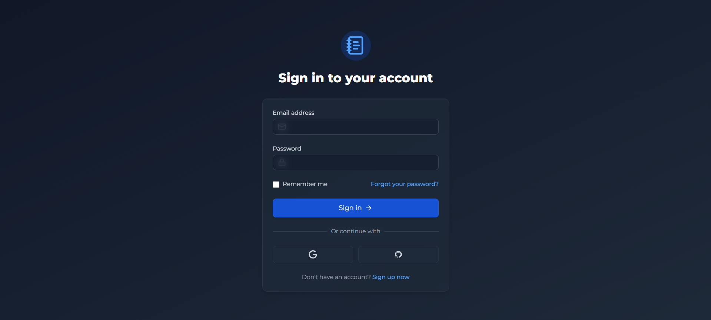
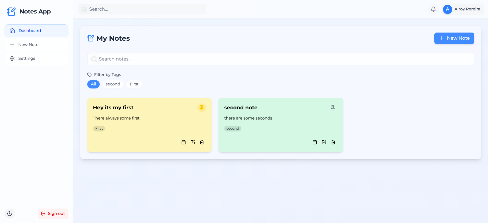
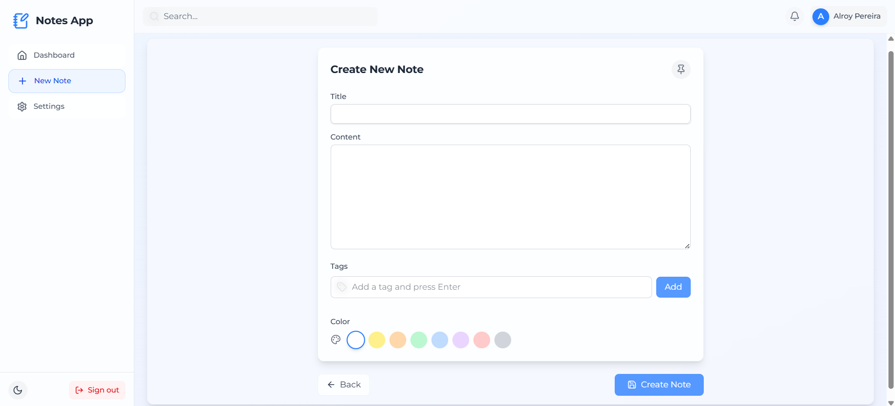
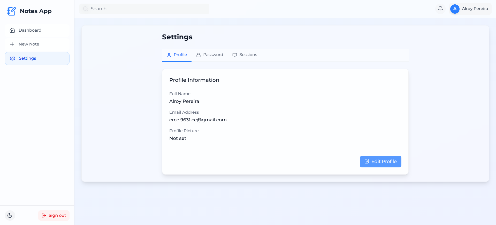
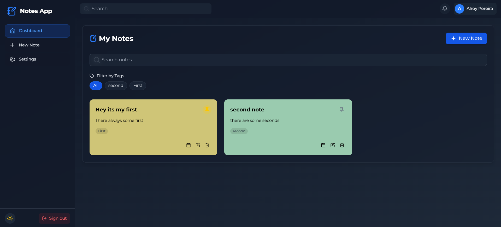

# Notes App

A full-featured note-taking application with user authentication, real-time CRUD operations, and a responsive design. This project combines a Node.js/Express.js backend with a React.js frontend to create a seamless note management experience.

## 1. Login Page


## 2. Dashboard


## 3. Create/Update Note


## 4. Profile Settings


## 5. Dark Mode


## Features

### Core Functionality
- **User Authentication**: Secure signup/login with JWT and cookie-based sessions.
- **Notes Management**: Create, read, update, and delete notes with rich formatting.
- **Organization**: Tag system and color-coding for better note organization.
- **Responsive Design**: Fully functional on mobile, tablet, and desktop.

### Enhanced Features
- **Dark/Light Mode**: Theme toggle with system preference detection.
- **Session Management**: View and control active login sessions.
- **Pinned Notes**: Highlight important notes.
- **Search & Filter**: Find notes by content or tags.
- **Form Validation**: Client-side and server-side validation.

## Technology Stack

### Backend
- **Runtime**: Node.js
- **Framework**: Express.js
- **Database**: MongoDB (with Mongoose ODM)
- **Authentication**: JWT with HTTP-only cookies
- **Security**: Helmet, CORS, rate limiting
- **Other Packages**:
  - `bcryptjs` for password hashing
  - `validator` for input sanitization
  - `jsonwebtoken` for session management
  - `multer` for file uploads (profile pictures)
  - `nodemailer` for email verification

### Frontend
- **Framework**: React.js
- **State Management**: Zustand
- **Styling**: Tailwind CSS with custom theming
- **Icons**: Lucide React
- **Form Handling**: React Hook Form
- **Routing**: React Router v6
- **Animations**: Framer Motion
- **HTTP Client**: Axios with interceptors

## Project Structure

```
notes-app/
├── backend/
│   ├── controllers/       # Route handlers
│   ├── models/            # MongoDB schemas
│   ├── routes/            # API endpoints
│   ├── middlewares/       # Auth and validation
│   ├── utils/             # Helper functions
│   ├── config.js          # Environment config
│   └── server.js          # Express app setup
│
├── frontend/
│   ├── public/            # Static assets
│   ├── src/
│   │   ├── components/    # Reusable UI components
│   │   ├── pages/         # Route components
│   │   ├── store/         # Zustand stores
│   │   ├── services/      # API service layer
│   │   ├── hooks/         # Custom hooks
│   │   ├── utils/         # Helper functions
│   │   └── App.js         # Main application
│   └── ...
│
├── .env.example           # Environment variables template
└── README.md              # Project documentation
```

## Setup Instructions

### Backend Setup
1. Navigate to the backend folder: `cd backend`
2. Install dependencies: `npm install`
3. Create a `.env` file based on `.env.example`
4. Start the development server: `npm run dev`

### Frontend Setup
1. Navigate to the frontend folder: `cd frontend`
2. Install dependencies: `npm install`
3. Start the development server: `npm start`

## Enhancements Implemented

### Security
- HTTP-only cookies for JWT storage
- CSRF protection middleware
- Rate limiting on auth routes
- Input sanitization and validation

### Performance
- Database indexing for frequent queries
- Optimistic UI updates
- Code splitting for routes
- Efficient state management

### User Experience
- Loading skeletons for async operations
- Toast notifications for user feedback
- Keyboard shortcuts for common actions
- Responsive design down to 320px width

## Future Improvements
- **Collaboration Features**: Real-time collaborative editing
- **Note Sharing**: Public/private note sharing options
- **File Attachments**: Support for image/file uploads
- **Webhooks**: Integration with other services
- **Mobile App**: React Native version

---
This application demonstrates modern full-stack development practices with attention to security, performance, and user experience. The clean architecture allows for easy extension with additional features.
